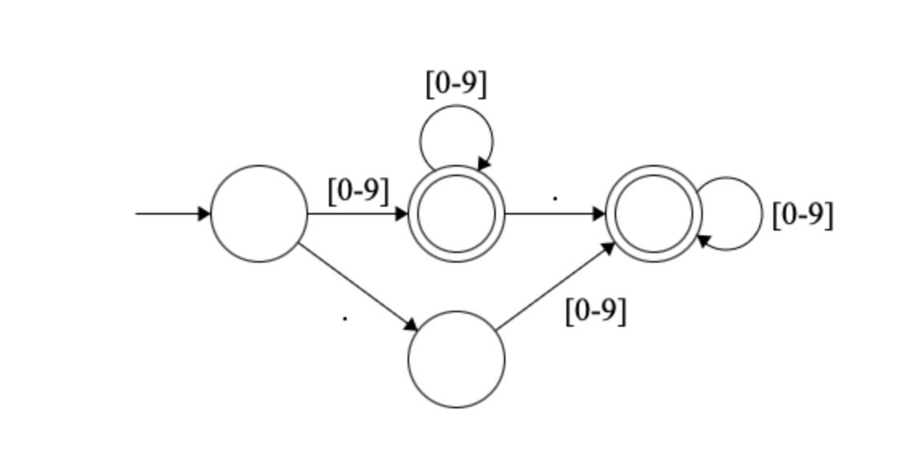
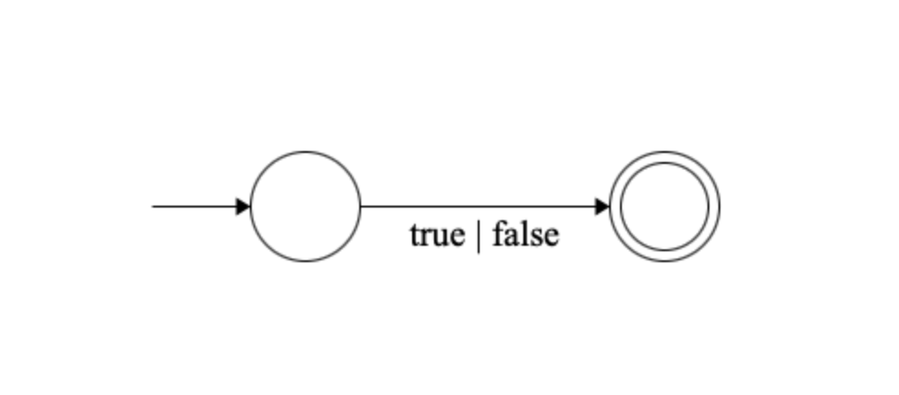
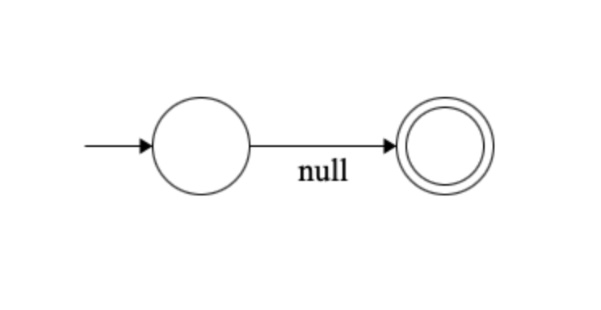
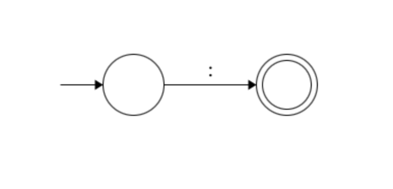
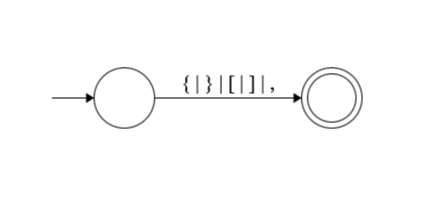

# JSON-Parser

A brief description of JSON-Parser and its purpose.

## Table of Contents
- [Team Members](#teammembers)
- [Features](#features)
- [Token Types](#tokentypes)
- [Installation](#installation)

# Team Members

- Larry Davis lrd2139@columbia.edu
- Terry Foley tf2512@columbia.edu

## Features

- List the main features of your project.
- Highlight any important functionalities.

## Token Types

- String: '"' ( '\\' . | ~[\\"] )* '"'
- Number: [0-9]+ ( '.' [0-9]* )? | '.' [0-9]+
- 

  
- Boolean: (true | false)
  

  
- Null: null
  

  
- Operator: ':'
  

  
- Separator: (\, | \{ | \} | \[ | \])
  

  
<!-- Identifiers will become the keys in key/value pairs in JS and Python, which will likely have
their own set of rules (eg. not starting with a number), but for this initial step we will treat all Identifiers
as Strings -->
<!-- - Example Identifier: '"' (^[A-Za-z_$][A-Za-z0-9_$]*$)|(^['"][^'"]*['"]$) '"' -->

## Installation

1. Clone the repository:
   ```bash
   git clone git@github.com:Terry555/json-parser.git
   Detailed steps for installation (matching the shell script file) to be included here later!!
