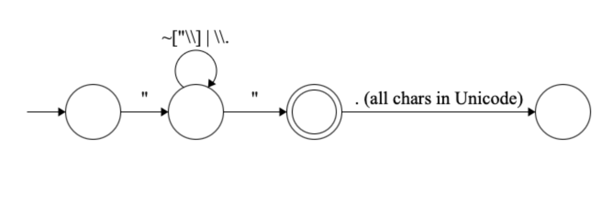

# JSON-Parser

This is designed to take JSON files and parse them into tokens. 

## Table of Contents
- [Team Members](#teammembers)
- [Features](#features)
- [Token Types](#tokentypes)
- [Installation](#installation)

# Team Members

- Larry Davis lrd2139@columbia.edu
- Terry Foley tf2512@columbia.edu

## Features

- This is the beginning stages of what will be a JSON parser. As of now, the file "lexical_analyzer.py" accepts any number of .json files as arguments, and will tokenize each file. It will output each token according to the categories below. It will then state if the file passes or fails based on if the file only has valid tokens. 

## Token Types

- String: '"' ( '\\' . | ~[\\"] )* '"'
<<<<<<< HEAD
- Number: [0-9]+ ( '.' [0-9]* )? | '.' [0-9]+ 

=======


  
- Number: [0-9]+ ( '.' [0-9]* )? | '.' [0-9]+
  
>>>>>>> origin/main

  
- Boolean: (true | false)
  

  
- Null: null
  

  
- Operator: ':'
  

  
- Separator: (\, | \{ | \} | \[ | \])
  

  
<!-- Identifiers will become the keys in key/value pairs in JS and Python, which will likely have
their own set of rules (eg. not starting with a number), but for this initial step we will treat all Identifiers
as Strings -->
<!-- - Example Identifier: '"' (^[A-Za-z_$][A-Za-z0-9_$]*$)|(^['"][^'"]*['"]$) '"' -->

## Installation

1. Clone the repository:
   ```bash
   git clone git@github.com:Terry555/json-parser.git
   If the user does not have python installed, detailed steps for installation are included in the shell script file "run_script.sh". 
2. Run the file "lexical_analyzer.py", which at the moment accepts all .json files in the "test_cases" folder. 